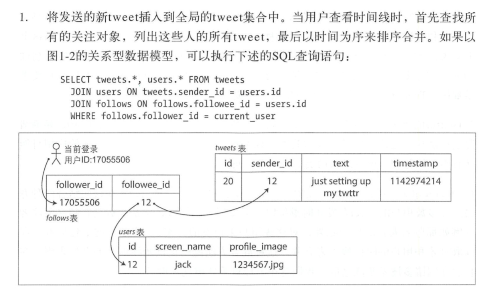
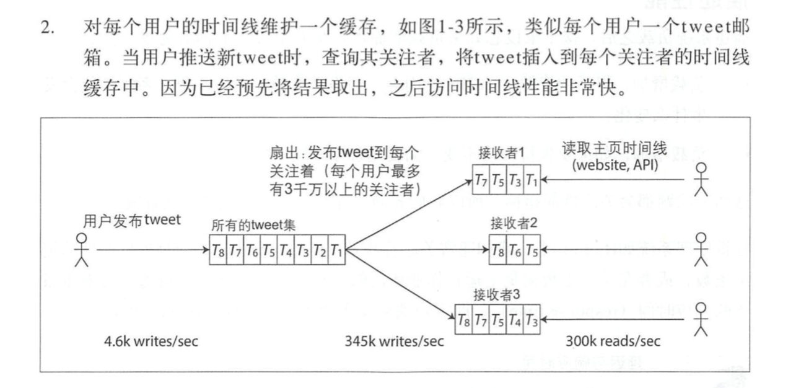
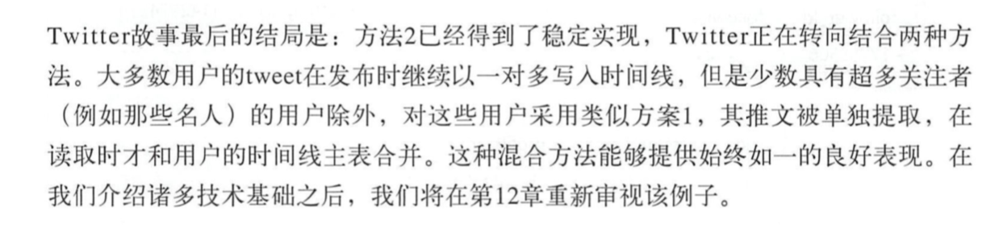
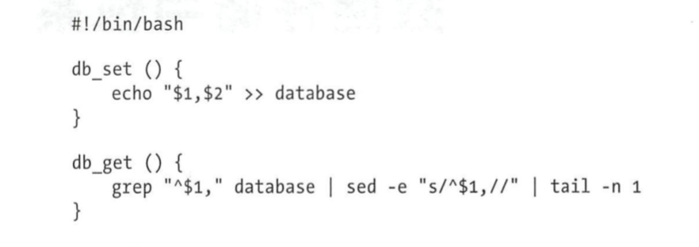

# 第一章 可靠, 可扩展与可维护的应用

常见的APP(数据系统)包括如下模块:

- 数据库
- 高速缓存
- 索引
- 流式处理 -- 持续发送消息到另外一个模块
- 批处理 -- 定期处理大量的累计数据

## 认识数据系统

为系统异常而设计 -- 局部失效? 负载增加? 降级? 

### 可靠性

- 硬件故障 (比如硬盘故障)
- 软件错误
- 人为错误 (操作失误, 运维)

### 可扩展性

#### 描述负载

##### 描述了推特的tweet流的设计.

它的设计也是渐进型的:

形态1: 用关系数据库维护的tweets:

形态2:加缓存 

形态3:

#### 描述性能

延迟和吞吐量

### 可维护性

# 第二章  数据模型与查询语言

  大多数都是调用下一层接口来实现高级功能的

## 文档数据库和关系数据库

文档数据库相比而言, 有更强的局部性和无模式. 而sql则在连接操作上更牛 且具有更简洁的表达.

# 第三章 数据存储与检索

常见的存储引擎:

| 存储引擎           |      |      |      |
| ------------------ | ---- | ---- | ---- |
| 日志结构型存储引擎 |      |      |      |
| 面向页的存储引擎   |      |      |      |
| 列存储        |      |      |      |

## 渐进的实现一个K-V单机存储

#### (1) 一个最简单的k-v存储 (不断向文件追加字符)

优点:  写入快.   

缺点:  如果数据多了, 那么查询慢O(n)

#### (2) 解决查询问题, 引入索引.  那么相对的 写入肯定会变慢 (因为还要更新索引了)

使用Hash索引放在内存中. key是上面的k. value是最新的v对应在文件中的offset.

问题: (1)文件太大. (2)key放不到一个完整的内存中怎么办? (3) 区间查询

解决: (1) 分段存储(过一段时间后生成一个新的文件) + 加入压缩. 后台去掉重复k (2) 待定 (3) 待定

其他思考点: 

- 采用高效的二进制格式 而不是CSV
- 删除记录通过墓碑标记实现 一个特殊的标记
- 崩溃恢复 -- 从头遍历每个段来从建hashmap
- 部分写入 -- 校验和 丢弃破坏记录
- 并发控制 
- 采用追加的方式而不是原地修改文件 --- 顺序写更快, 并发和崩溃恢复更容易

#### (3) 为了解决内存放不下和区间查询而引入的sstables/LSM-Tree

前面的每个日志段文件都是按顺序存储数据的写入值, 而**sstables 保证单个段内的key-value按照键顺序排列**. (单个键只出现一次在每个日志段文件中)

这种方式解决了: 

(a) 内存放不下所有key -- 我们可以使用稀疏索引 比如每个文件的第一个key和最后一个key

(b)区间查询 -- 单个文件内是有序存储.

构建和维护这个排序结构:

- 写入时, 先写入内存中的平衡树结构
- 当内存中数据量大于某个值作为SSTable写入磁盘. 同时生成一个新的内存表
- 读取时, 先从内存中查询, 然后是最新的SSTable文件, 然后是次新的SSTable....
- 后台周期性何必SSTables

为了解决内存结构的崩溃问题: 可以引入WAL 日志用于崩溃时恢复内存数据.

很多产品: HBase , Casandra, LevelDB 都是这种: **合并和压缩排序文件** LSM = 保存和维护一系列SSTables

为了解决读取时可能一直读到很旧的文件的性能优化:

- 采用BloomFilter 快速过滤掉不存在的key
- 如何高效管理压缩和合并 (有按照大小合并)

## 基于Btree的存储引擎  固定页的方式

BTree索引

## 全文索引和模糊索引

比如lucene的实现.  一般我们前面讲到的内存中的hash索引, key是插入的key, value是文件中的offset.  而且是稀疏的key分布.

在lucene中, key是字符序列的FSM, 类似于字典树,可以转换为Levenshtein自动机. 支持在编辑距离内搜索单词.

 

