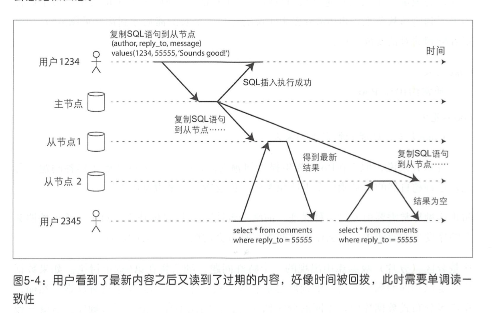
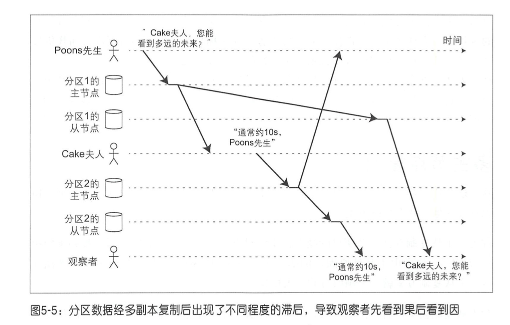
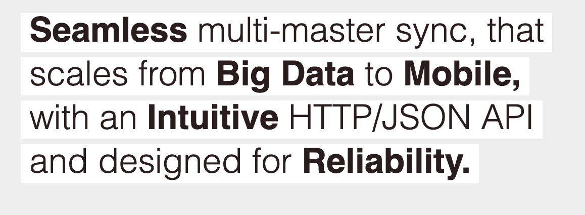

#  分布式数据库系统

将数据分布在多个节点的方式:

- 复制  -- 多个地方保存一样的数据
- 分区  -- 将大数据分为一小块一小块

他们一般**组合使用**


# 数据复制 第5章

我们先讨论单个节点可以容纳所有数据. 后续考虑容纳不了的时候所必须的分区操作.

常见的复制方法:

| 复制方法     |      |      |      |
| ------------ | ---- | ---- | ---- |
| 主从复制     |      |      |      |
| 多主节点复制 |      |      |      |
| 无主节点复制 |      |      |      |

复制方式:

同步复制和异步复制


## 主从复制

工作流程:

1. 指定一个主副本, 客户写入数据时, 只能写入主副本
2. 主副本把**数据更改**或者**更改流**复制到从副本. 保持一致的写入顺序.
3. 读取数据可以从主副本或者从副本查询. 但是写只能在主副本.

例子: MySQL, Kafka, MongoDB等都支持.

kafka的主从复制是partition级别的.  每个partition维护自己的ISR 有自己的Leader.

> The unit of replication is the topic partition. Under non-failure  conditions, each partition in Kafka has a single leader and zero or more followers. 

同步复制:等待副本完成写入才正式回复给客户端.  实际中不会把所有副本都设置为同步复制因为这样完全丧失了可用性.  一般会设置某个从副本为同步复制(也被称为**半同步** = 1主+1同步从 + 0+ 异步从). 另外的则还是异步复制.

异步复制: 完全的异步复制. 可能会有**复制滞后问题** (已经写入主 但是来不及复制给从), 后面有详细介绍.

kafka实际上应该是可以配置的. 具体取决于acks变量.  

> **acks**: 什么时候回复客户端消息已经提交. The following settings are allowed: 
>
> - `acks=0` 发送者不等待服务器任何回复 直接认为写入成功
> - `acks=1` 主副本完成写入.  不等待从副本响应
> - `acks=all` 等待所有ISR副本完成写入.

### 配置新的节点

一般采用快照+与快照关联的log seq number来完成追赶数据.  log seq number 用于知道快照后的修改从什么位置开始.

mysql叫binlog coordinates.  Postgresql 叫log sequence number.


### 节点失效

#### 从节点失效

#### 主节点失效

一般按照如下的方式恢复:

1. 确认主节点失效
2. 选举新的主节点. 典型的共识问题 - 只能有一个主节点
3. 配置新的主节点生效.

这其中的可能的需要考虑的问题:

- 异步复制中的新的主节点可能没有全部的数据
- 可能会有2个节点都认为自己是主节点 **(脑裂)** -- 比如GC暂停  解决方式就是底层需要有令牌机制fencing.
- 合适的超时检测时间是多少?

zookeeper如何解决脑裂问题?  --- 多数人机制和 epoch机制.  主节点需要同步信息到其他集群中的节点, 然而其他节点会拒绝, 因为他们有更大的epoch (这个值在新开始选举时增加)

### 复制日志的实现

1. 基于语句的实现  -- 比如复制sql语句. 这种需要注意有些场景不能使用 (比如使用NOW(), 或者触发其他触发器的) mysql5.1之前在用
2. 基于WAL的实现 --postgresql  和 oracle都采用这种. 需要保证传输协议和版本的兼容性
3. 基于行的逻辑日志 --mysql的binlog就是.  记录每行的新旧值


### 复制滞后问题

这是异步复制场景下的问题. 

#### 读自己写

读到自己提交的修改.   适用于读多写少的场景.

举例来说: 下面的例子 用户可能看到自己刚才的修改丢失了:


这里的是写后读一致性. 该描述的是自己对自己资料的更新肯定对自己可见 但是别人不一定可以看到修改.  

解决的办法:

- 根据业务特点决定读取数据的数据源. 比如用户修改的自己的资料.  我们可以约定读取自己的资料都从主节点读取. 读取别的信息可以从从节点读取.
- 上面这个可能大部分请求都到了主节点就没啥意义了.  我们可以跟踪一个最近更新的时间来决定是否从主节点读取.比如小于1分钟时就从主节点读取. (这里的时间戳可以是物理或者逻辑时钟)

上面的办法都比较困难.  比如对每个资源都要记录最近更新时间 而且全局共享.

#### 单调读

上面的异步复制还有可能有下面一个问题:



用户2345 很奇怪: 前面看到了最新结果 结果再刷新就没了....--- 他以为是**回滚现象** (读到新值后又读到旧值)

解决该问题的一种方式:  在副本没失效时, 绑定到某个副本读取. 比如基于用户id的hash

#### 前缀一致读



有多个分区时, 而分区之间的因果顺序发生错乱.   

解决办法: (1) 有因果关系的请求发送到同一个分区 比如我们的tsdb就是. (2) 显示跟踪happens-before  后面会介绍.

## 多主节点复制

主主复制.一般用于多数据中心的数据备份.  例如mysql的tungsten replicator, postgresql 的bdr 和oracle的golden gate


这里面有个很重要的就是"冲突解决" 多个数据中心可能同时修改某一个数据.

处理写冲突:


- 避免冲突 比如用户A的都访问主节点1 , 但是这样只能避免/减少冲突 无法完全杜绝
- 收敛于一致状态.  最终数据要么是B要么是C而不能是一个是B 一个是C.  比如我们可以给每个节点一个优先级来自动处理或者记录所有的冲突提示用户来决定
- 用户自定义解决冲突的方式.  比如 在写入时如果有冲突调用用户脚本解决冲突.  或者在读取时执行, 返回所有冲突数据给客户,应用自己决定如何解决 比如CouchDB.

当然上面的这些方式只适合解决简单的冲突, 比如单行冲突.  但是对于复杂的冲突就不好做了. 多主复制实际并不是很流行因为它太容易出错

-------

CouchDb




他的解决方式:  保留所有的冲突版本并复制, 然后提供接口支持返回所有冲突的数据

ref: https://docs.couchdb.org/en/stable/replication/conflicts.html

---------


## 无主节点复制

一般没有主节点. 但是可能会有一个协调者来代表客户端写入. 但是协调者不负责维护顺序. 其中所有的节点都可以执行写请求.  Casandra和voldemort还有亚马逊的dynamo都是.

无主复制一般用于多数据中心环境.  和前面的多主节点一样 他也会面临冲突.

关于如何描述写入成功?  一般采用w+r >n 来描述.  n副本数 (不是节点数).  w并发写入副本数量, r并发读取副本数量.

这个实际上保证了w和r中肯定有重合的节点, 也就是肯定能读到最新的数据.

为了解决冲突问题, 无主系统(Casandra)一般采用的是Last Write Win. ---这样可能丢失更新.  

对于某些cache系统无所谓, 但可能不适合关键场景的.

还有一种办法就是合并写入的值.


# 分区 第6章

解决单机场景无法解决的海量数据问题.  **提高可扩展性的无功效架构**

**分区**在不同的系统中有不同的称呼.  比如kafka - partition, es/mongodb - shard, hbase - region, tidb - region.

主要涉及如下问题:  如何分区 -> 分区的再平衡 -> 如何路由到正确的分区

## 分区方式

#### k-v数据的分区

##### 基于key的分区

类似于书的目录结构. HBase, bigtable, 以及 mongodb (<2.4). tikv采用的这种. 因为sql需要区间查询.


某些访问模式可能导致的访问热点, 需要根据业务添加额外的字段作为key来避免原来key的热点访问问题.

##### 基于hash(key)的分区

这样有个问题就是**不能区间查询了**. mongodb中可以配置 (如果选这个, 区间查询分配到所有分区).

这种模式也可能有热点. 比如有个名人的userid总是一个. 这时候只能业务层解决.

#### 二级索引的分区

比如mysql中通过create index创建的索引. HBASE都不支持二级索引.

二级索引的问题就是如何将不规则的数据映射到分区中.

主要解决办法:

#####  (1) 基于文档分区的二级索引 


每个分区独立维护自己的二级索引.  color和make是二级索引字段.

这种索引并**不是全局索引**.  叫 **"分散/聚集"**.  容易有读延迟放大问题. (比如查询color=red 必须并行发给所有分区).

mongodb和es,casandra都采用的这种方式.

##### (2) 基于词条的分区


依然有分区 但是某一类值比如color=red在一个特定的分区上.  这种读取快些 但是 写入可能慢. 因为单个文档可能需要更新多个二级索引, 必然会更新多个分区的多个二级索引. 一般采用的是异步更新二级索引. dynamo db采用这种方法.

TiDB采用的是这种全局索引的方式 [ref](https://m.open-open.com/lib/view/open1488788900732.html) .  google f1 也是 [ref](https://www.cnblogs.com/foxmailed/p/4366692.html)


## 请求路由

一般有如下几种:


一般使用zk等协调服务来记录这些元数据:


还有一类是使用gossip来实现的方案1. (节点之间的信息通过gossip传播)

## 下一步

一般说来, 分区相对独立, 如果1个写请求扩分区了, 一个分区成功了, 一个分区失败了怎么办?  下章解决.


# 事务 第7章

## acid

- a = 不关心并发性, 而关心的是客户端1个请求中包含多个写操作时的处理. (某个操作出错时, 丢弃已完成的操作的修改)
- c = 应用程序所期待的预期状态. 不违背.数据库本身不能保证c, 一般是应用程序通过a和i来达到.
- i = 多个客户端访问时的结果, 应该相互隔离还是相互有一些影响?
- d = 一般假定磁盘提供

ACID给数据库的理念: 如果存在违反了 A I D的风险,则完全放弃整个事务 而不是部分放弃.

这个并不是每个系统都会保证的, 比如无主复制,  他就不管a, 而是直接交给客户处理.


## 事务失败时怎么处理?

- 重试 -- 要注意如果db已经成功 只是返回时失败了, 那么app段需要处理.
- 设置一个重试次数上限.  
- 永久性故障 重试没有意义
- 多个系统之间的重试要仔细定义.

## 弱隔离级别 (非串行化)

介绍下几种弱的隔离级别

### 读提交

一般数据库的默认隔离级别.

- 读数据时, 只看到已经提交的数据
- 写数据时,只会覆盖已经提交成功的数据


脏写:(我们不应该看到两个不完全的更新混在了一起)


一般如何实现读提交:

防止脏读:方式1: 读锁 (一般不会采用 因为在OLAP等场景下读取数据很频繁而且持续时间很长). 方式2: 存储2个数据(旧值和当前持有锁想要设置的新值). 只有事务提交后才能看到新值. -- 后面可以看到MVCC是它的一个简单扩充.

防止脏写:通过写锁.

### 快照隔离与可重复读

不可重复读(对读取的**某一行**发现它的数据变了 比如select * from t where id=1).这对于某些应用是不允许的.  


* 虽然她一会儿刷新一下就可以了  但是可能还是在某些场景下不对

解决的办法是:MVCC  -- 存储多个版本数据 + 不同的快照生成策略 (和依据trx_id精巧设计的可见性规则)

读提交:  单个事务中的每个查询生成一个快照.

可重复读: 单个事务中, 都使用事务开始时创建的快照.

[mysql的实现源码在这里](https://blog.csdn.net/scugxl/article/details/102911145)

不同数据库的可重复读, 快照隔离定义都不一样.

比如 oracle称它的SI叫可串行化,  mysql和postgresql则叫可重复读. 而db2的可重复读则实际上是可串行化.

**更新丢失问题**

比如多个事务同时:

- 递增一个计数器
- 修改同一个对象的不同属性

实际上mysql在SI并不能解决丢失更新. (除非带上for update的显式加锁) 而pg和oracle则可以. (检测并终止有问题的事务).    这个项目描述了很方便的例子(演示各个数据库能解决的隔离级别问题): https://github.com/ept/hermitage

```
#mysql test
set session transaction isolation level repeatable read; begin; -- T1
set session transaction isolation level repeatable read; begin; -- T2
select * from test where id = 1; -- T1
select * from test where id = 1; -- T2
update test set value = 11 where id = 1; -- T1
update test set value = 11 where id = 1; -- T2, BLOCKS
commit; -- T1
commit; -- T2
```

```
# pg test:
begin; set transaction isolation level repeatable read; -- T1
begin; set transaction isolation level repeatable read; -- T2
select * from test where id = 1; -- T1
select * from test where id = 1; -- T2
update test set value = 11 where id = 1; -- T1
update test set value = 11 where id = 1; -- T2, BLOCKS
commit; -- T1. T2 now prints out "ERROR: could not serialize access due to concurrent update"
abort;  -- T2. There's nothing else we can do, this transaction has failed
```


并发写可能遇到的问题: 

- 脏写 覆盖还没有提交事务的部分写入
- 更新丢失 (read-modify-write)  某个人的write被覆盖
- 更加复杂的写冲突问题 (写倾斜)   也可以看做一种广义的幻读. (一个写入改变了另外一个事务的查询结果)

SI可以解决只读查询中的幻读 但是对于如下的读写 复杂的场景这不行:


这种情况只有对条件加上for update强制加锁才行:


总结:


SSI实现: (1) 检测是否读取了过期的MVCC对象  (db追踪因为MVCC被忽略的写操作, 当当前事务提交时, 检查这些操作是否已经提交, 如果这些写操作已经提交, 必须终止当前事务. -- 一般配合自动重试) --- 读取之前是否有未提交的写入

(2) 检测写是否影响了之前的读 -- 表级别追踪某些key被哪些事务读取的消息, 如果key被改了, 通知其他事务. -- 读取滞后是否又有新的写入


