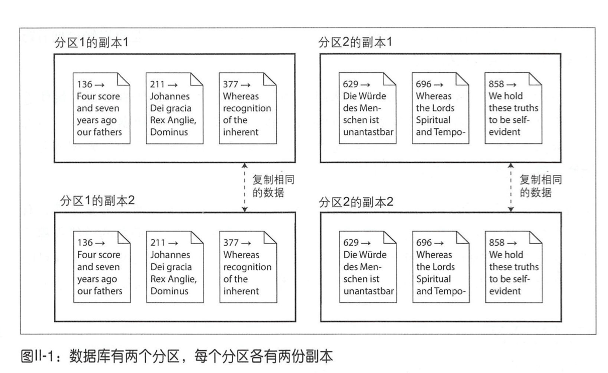
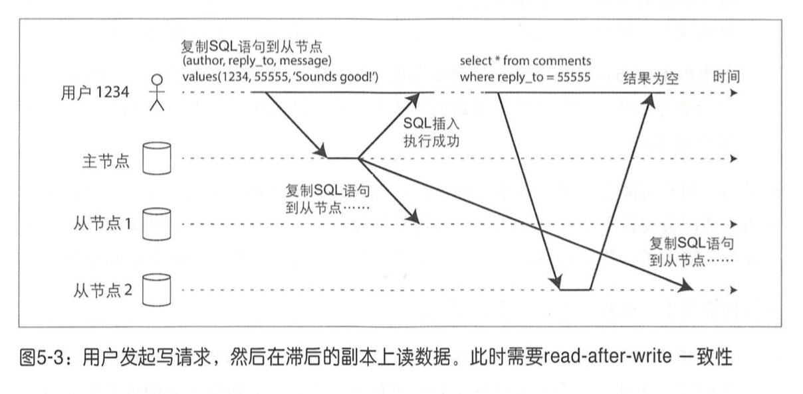
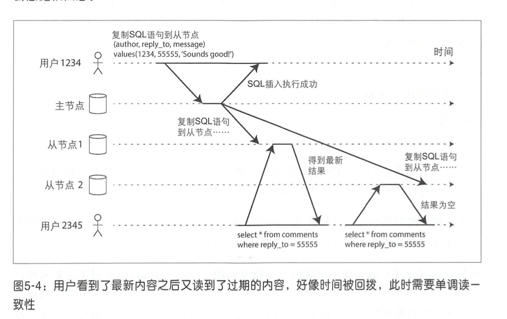
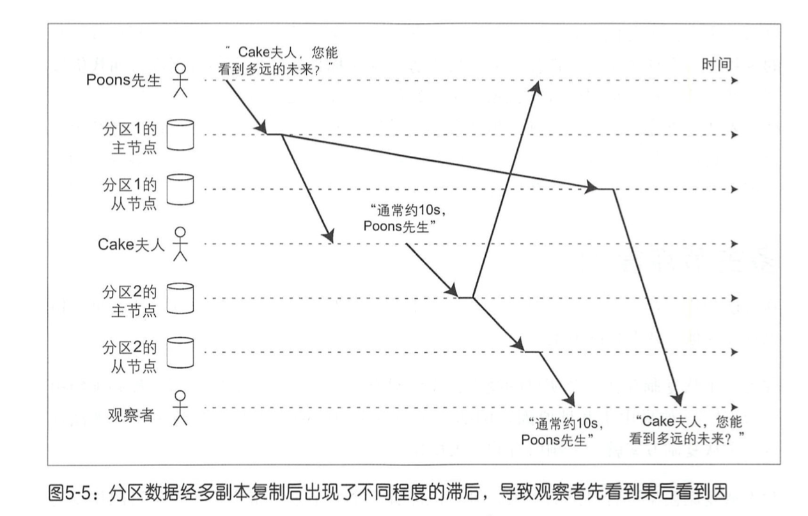
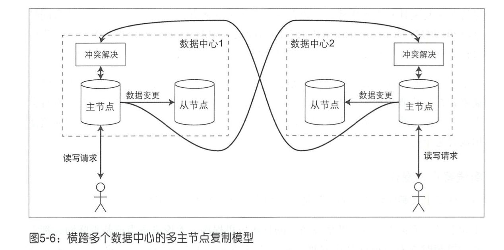
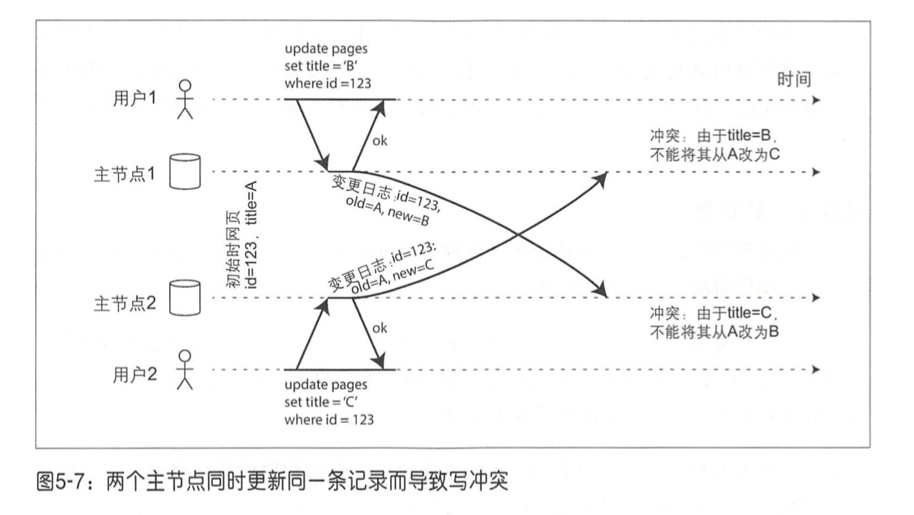
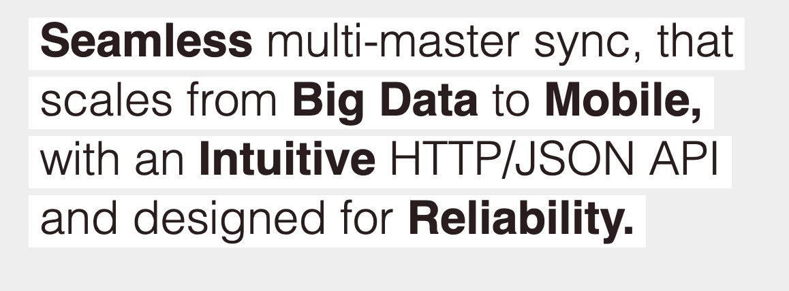

# 分布式数据库系统

将数据分布在多个节点的方式:

- 复制  -- 多个地方保存一样的数据
- 分区  -- 将大数据分为一小块一小块

他们一般**组合使用**

# 数据复制

我们先讨论单个节点可以容纳所有数据. 后续考虑容纳不了的时候所必须的分区操作.

常见的复制方法:

| 复制方法     |      |      |      |
| ------------ | ---- | ---- | ---- |
| 主从复制     |      |      |      |
| 多主节点复制 |      |      |      |
| 无主节点复制 |      |      |      |

复制方式:

同步复制和异步复制

## 主从复制

工作流程:

1. 指定一个主副本, 客户写入数据时, 只能写入主副本
2. 主副本把**数据更改**或者**更改流**复制到从副本. 保持一致的写入顺序.
3. 读取数据可以从主副本或者从副本查询. 但是写只能在主副本.

例子: MySQL, Kafka, MongoDB等都支持.

kafka的主从复制是partition级别的.  每个partition维护自己的ISR 有自己的Leader.

> The unit of replication is the topic partition. Under non-failure  conditions, each partition in Kafka has a single leader and zero or more followers. 

同步复制:等待副本完成写入才正式回复给客户端.  实际中不会把所有副本都设置为同步复制因为这样完全丧失了可用性.  一般会设置某个从副本为同步复制(也被称为**半同步** = 1主+1同步从 + 0+ 异步从). 另外的则还是异步复制.

异步复制: 完全的异步复制. 可能会有**复制滞后问题** (已经写入主 但是来不及复制给从), 后面有详细介绍.

kafka实际上应该是可以配置的. 具体取决于acks变量.  

> **acks**: 什么时候回复客户端消息已经提交. The following settings are allowed: 
>
> - `acks=0` 发送者不等待服务器任何回复 直接认为写入成功
> - `acks=1` 主副本完成写入.  不等待从副本响应
> - `acks=all` 等待所有ISR副本完成写入.

### 配置新的节点

一般采用快照+与快照关联的log seq number来完成追赶数据.  log seq number 用于知道快照后的修改从什么位置开始.

mysql叫binlog coordinates.  Postgresql 叫log sequence number.

### 节点失效

#### 从节点失效

#### 主节点失效

一般按照如下的方式恢复:

1. 确认主节点失效
2. 选举新的主节点. 典型的共识问题 - 只能有一个主节点
3. 配置新的主节点生效.

这其中的可能的需要考虑的问题:

- 异步复制中的新的主节点可能没有全部的数据
- 可能会有2个节点都认为自己是主节点 **(脑裂)** -- 比如GC暂停  解决方式就是底层需要有令牌机制fencing.
- 合适的超时检测时间是多少?

zookeeper如何解决脑裂问题?  --- 多数人机制和 epoch机制.  主节点需要同步信息到其他集群中的节点, 然而其他节点会拒绝, 因为他们有更大的epoch (这个值在新开始选举时增加)

### 复制日志的实现

1. 基于语句的实现  -- 比如复制sql语句. 这种需要注意有些场景不能使用 (比如使用NOW(), 或者触发其他触发器的) mysql5.1之前在用
2. 基于WAL的实现 --postgresql  和 oracle都采用这种. 需要保证传输协议和版本的兼容性
3. 基于行的逻辑日志 --mysql的binlog就是.  记录每行的新旧值

### 复制滞后问题

这是异步复制场景下的问题. 

#### 读自己写

读到自己提交的修改.   适用于读多写少的场景.

举例来说: 下面的例子 用户可能看到自己刚才的修改丢失了:

这里的是写后读一致性. 该描述的是自己对自己资料的更新肯定对自己可见 但是别人不一定可以看到修改.  

解决的办法:

- 根据业务特点决定读取数据的数据源. 比如用户修改的自己的资料.  我们可以约定读取自己的资料都从主节点读取. 读取别的信息可以从从节点读取.
- 上面这个可能大部分请求都到了主节点就没啥意义了.  我们可以跟踪一个最近更新的时间来决定是否从主节点读取.比如小于1分钟时就从主节点读取. (这里的时间戳可以是物理或者逻辑时钟)

上面的办法都比较困难.  比如对每个资源都要记录最近更新时间 而且全局共享.

#### 单调读

上面的异步复制还有可能有下面一个问题:

用户2345 很奇怪: 前面看到了最新结果 结果再刷新就没了....--- 他以为是**回滚现象** (读到新值后又读到旧值)

解决该问题的一种方式:  在副本没失效时, 绑定到某个副本读取. 比如基于用户id的hash

#### 前缀一致读

有多个分区时, 而分区之间的因果顺序发生错乱.   

解决办法: (1) 有因果关系的请求发送到同一个分区 比如我们的tsdb就是. (2) 显示跟踪happens-before  后面会介绍.

## 多主节点复制

主主复制.一般用于多数据中心的数据备份.  例如mysql的tungsten replicator, postgresql 的bdr 和oracle的golden gate

这里面有个很重要的就是"冲突解决" 多个数据中心可能同时修改某一个数据.

处理写冲突:

- 避免冲突 比如用户A的都访问主节点1 , 但是这样只能避免/减少冲突 无法完全杜绝
- 收敛于一致状态.  最终数据要么是B要么是C而不能是一个是B 一个是C.  比如我们可以给每个节点一个优先级来自动处理或者记录所有的冲突提示用户来决定
- 用户自定义解决冲突的方式.  比如 在写入时如果有冲突调用用户脚本解决冲突.  或者在读取时执行, 返回所有冲突数据给客户,应用自己决定如何解决 比如CouchDB.

当然上面的这些方式只适合解决简单的冲突, 比如单行冲突.  但是对于复杂的冲突就不好做了. 多主复制实际并不是很流行因为它太容易出错

-------

CouchDb

他的解决方式:  保留所有的冲突版本并复制, 然后提供接口支持返回所有冲突的数据

ref: https://docs.couchdb.org/en/stable/replication/conflicts.html

---------

## 无主节点复制

